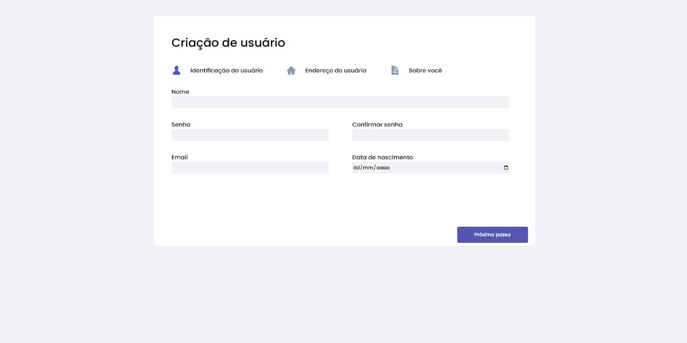
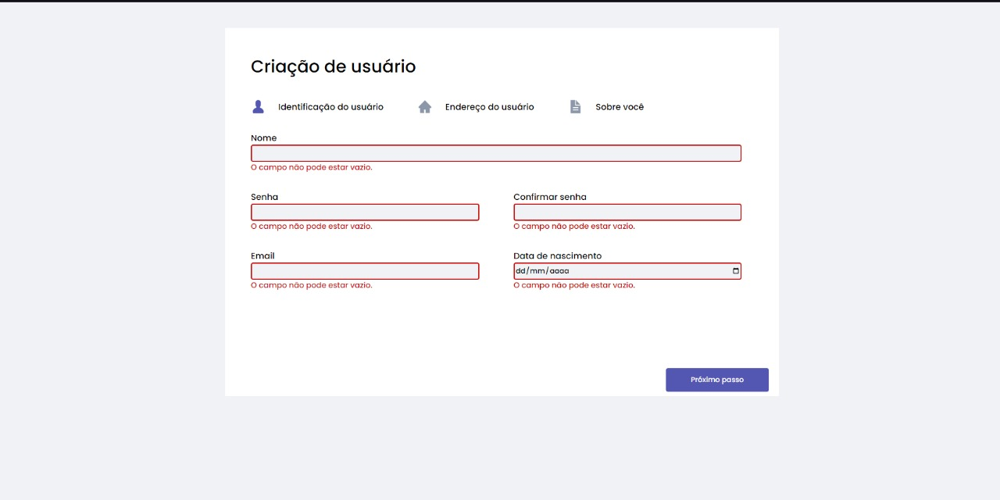
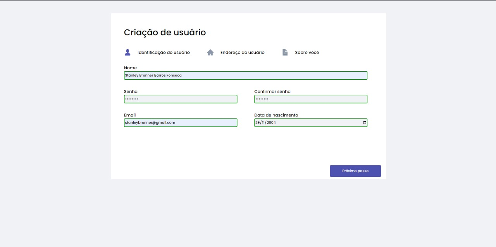
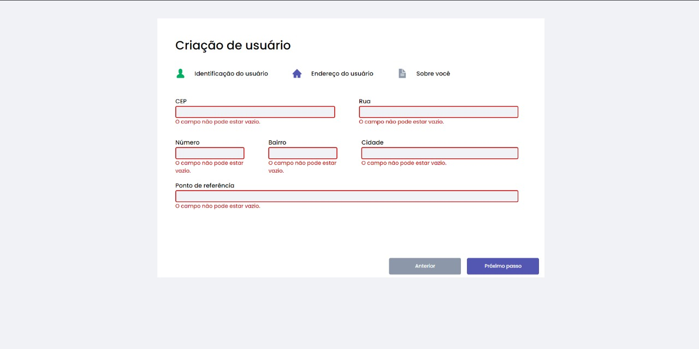
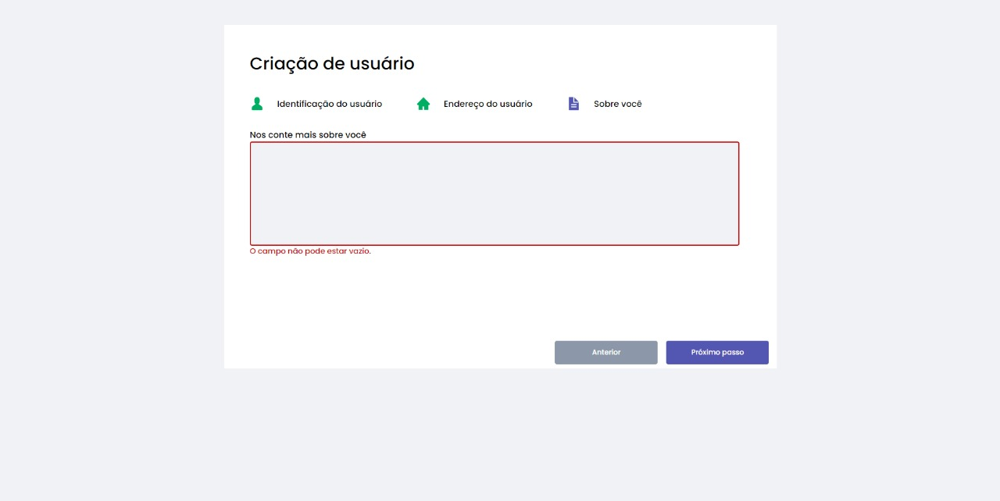
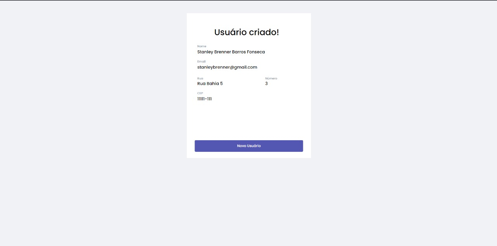

# Criação de Formulário feito com React.

Formulário para criação de usuário feito com ReactJS

# Sobre o formulário

🍃 O site foi feito inteiramente em ReactJS.

🍃 Todos os inputs possuem verificação e verificam se o usuário preencheu corretamente.

🍃 As páginas só podem ser acessadas na ordem correta.

🍃 Utilizei React Router para separar as partes do formulário.

🍃 Para estilização usei styled-components.

🍃 Além disso tem uso de react-icons, localStorage como banco de dados e entre outros.

## 📷 Fotos do projeto

### Partes do projeto:

Primeira parte do formulário.

Todas as partes possuem verificação de erro.

E verificam se o usuário preencheu tudo corretamente.

Segunda parte do formulário sendo verificado.

Terceira parte do formulário sendo verificado.

Alguns inputs do formulário possuem mais de uma verificação.

Página final mostrando informações do usuário.

## 🖥️Tecnologias que usei:

- React JS
- React Icons
- React Router

- Styled Components
- Prettier

- NodeJS
- NPM
